# Avidity Supply

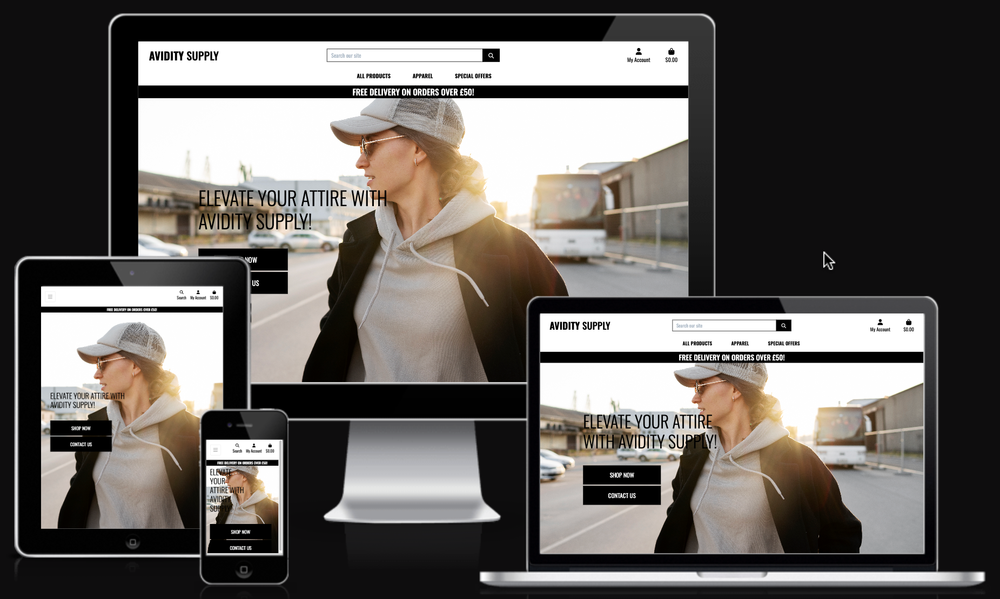

## Testing

### Code Validation

#### HTML
The [W3C Markup Validator](https://validator.w3.org/) service was used to validate the site's pages to ensure there were no syntax errors.

Home

Bag

Checkout

Checkout Success

Products

Product Detail

Product Management

Add Product

Edit Product

Add Review

Contact

#### CSS
The [W3 CSS Validator](https://jigsaw.w3.org/css-validator/) was used to validate custom css styling.

base.css

checkout.css

profile.css

#### JS
[JS HINT](https://jshint.com/) was used to test JaveaScript.

stripe_element.js

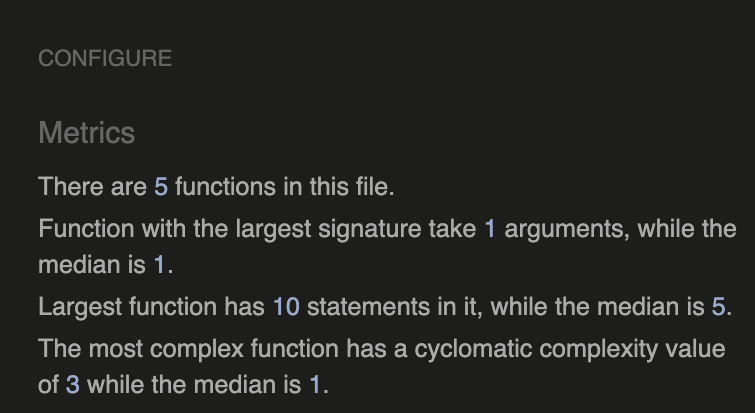

countryfield.js

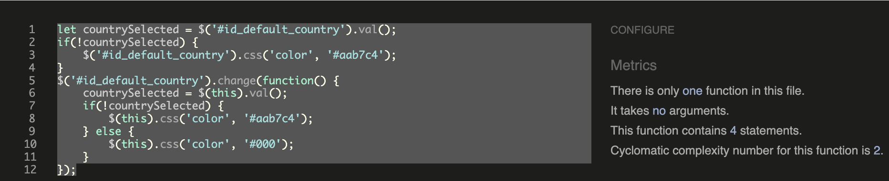

#### Python
[CI Pythong Linter](https://pep8ci.herokuapp.com/#) has been used to validate my python code and esnured it's pep8 compliant.

All python code created or automatically generated was validated and corrected and now displays no errors, so I have only provided the single screenshot.
- Note - some lines were too long and in an effort not to causes issues with my project '# NOQA' was used.

Python Validation

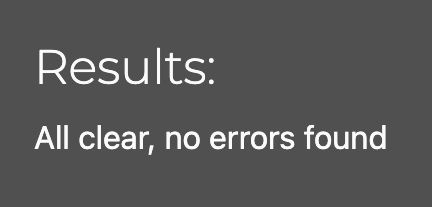

### Manual Testing

#### Lighthouse

The Chrome Developer Tools lighthouse feature was employed to assess performance, adherence to best practices, accessibility, and Search Engine Optimisation (SEO). Both desktop and mobile tests were conducted.

- Several lighthouse tests performed, were below where I'd like them to be but due to time constraints, I was unable to improve the score but would in future implementations.

| Page | Results |
| --- | --- |
| Home | 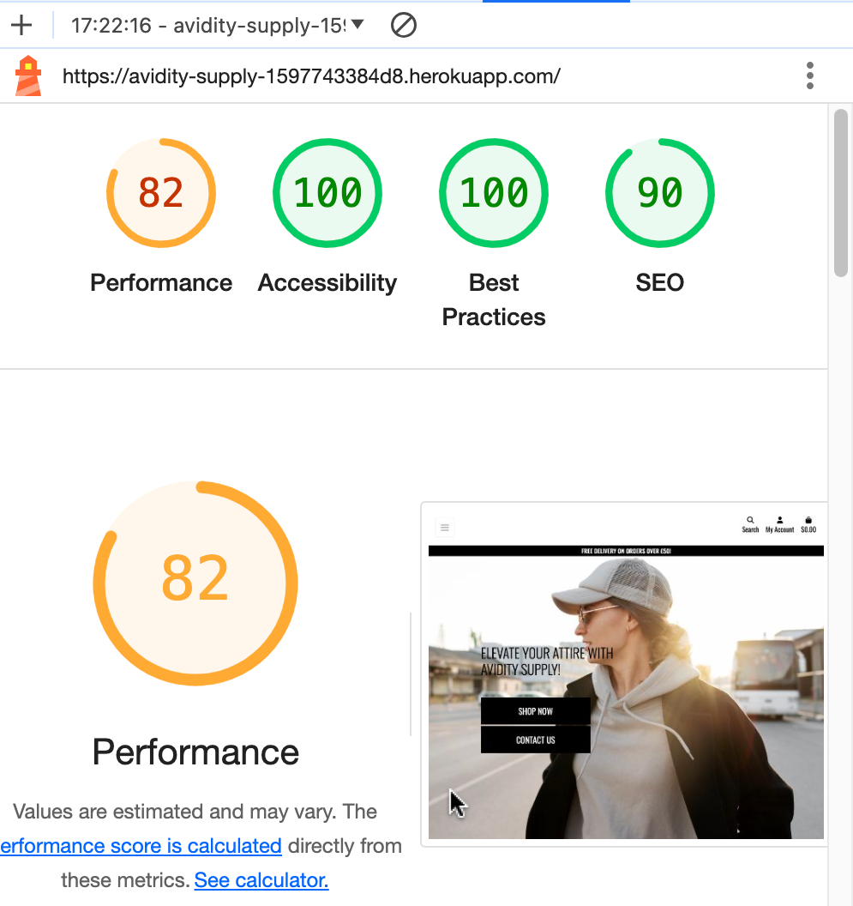 |
| Home (mobile) | 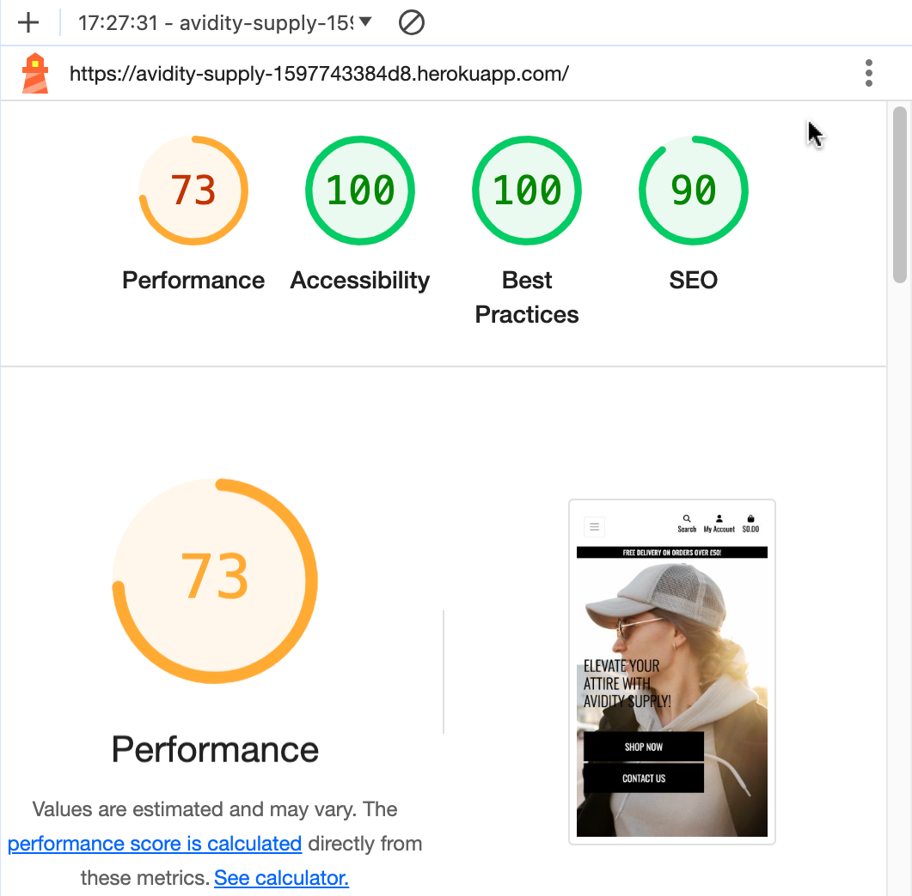 |
| Products | 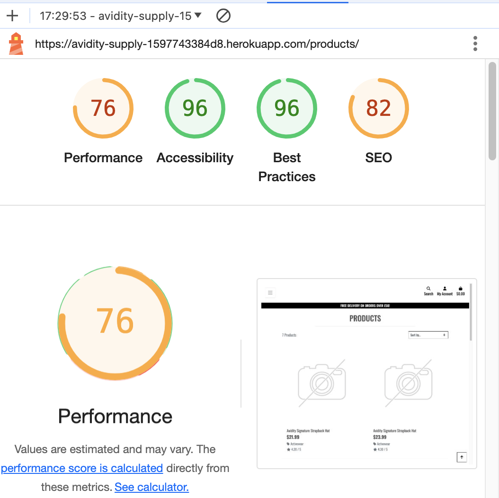 |
| Products (mobile) | 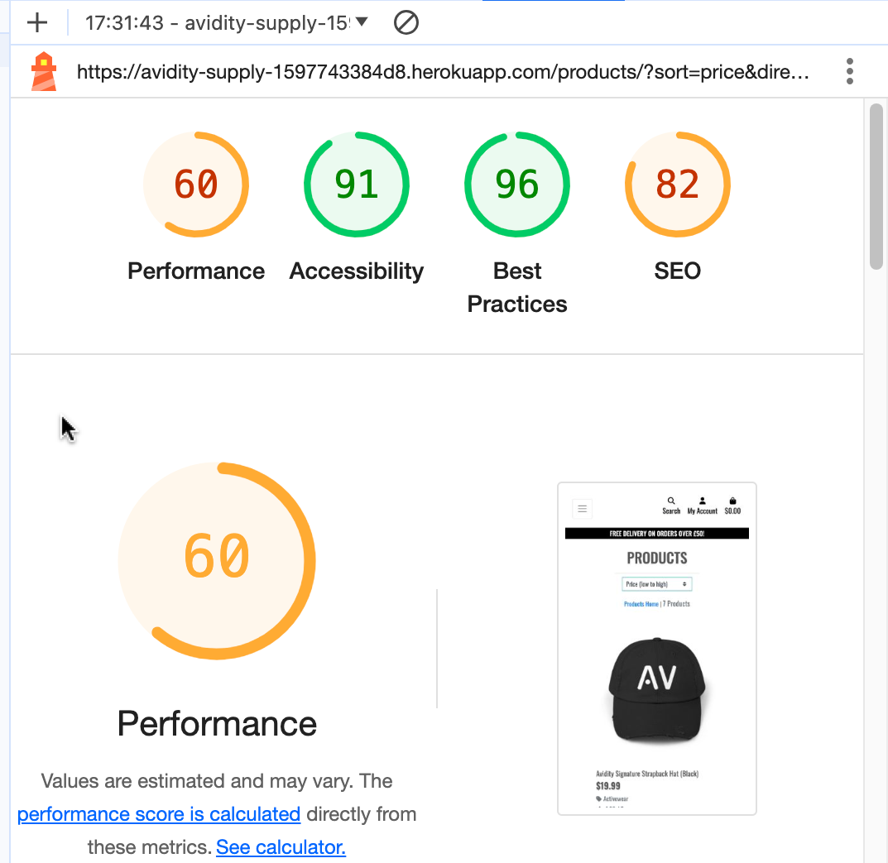 |
| Bag | 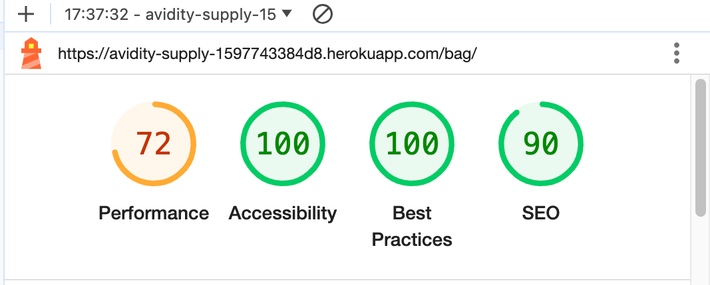 |
| Bag (mobile) | 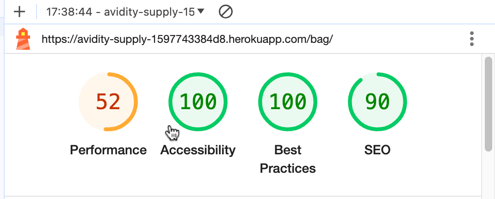 |
| Checkout | 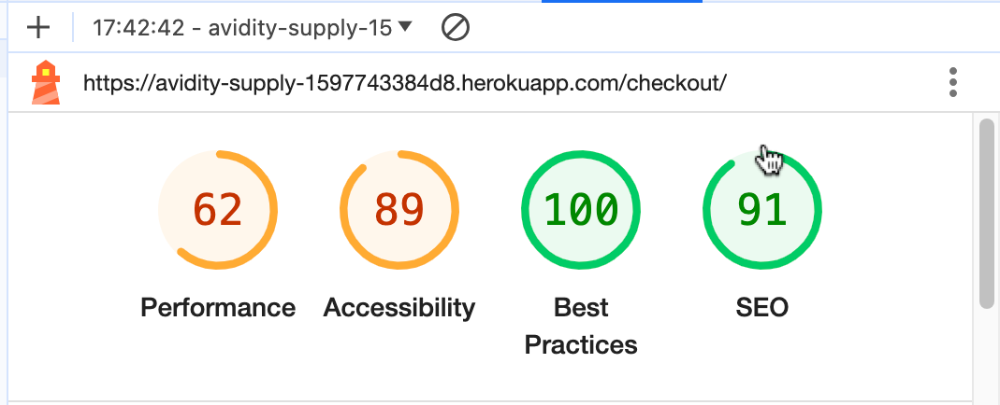 |
| Checkout (mobile) | 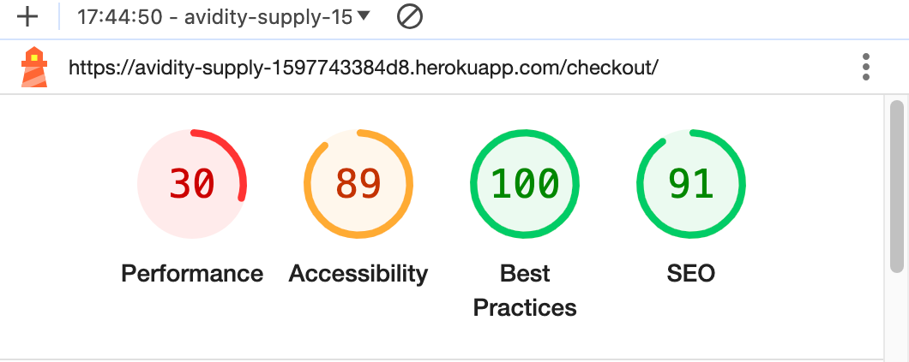 |
| Profile |  |
| Profile (mobile) |  |
| Contact | 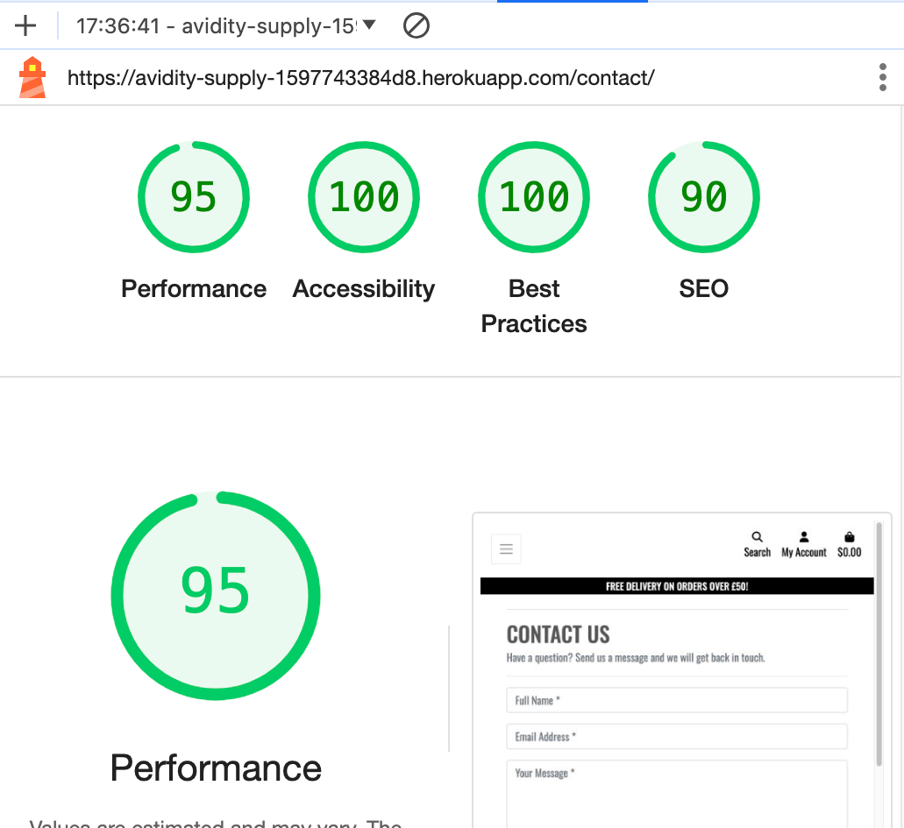 |
| Contact (mobile) | 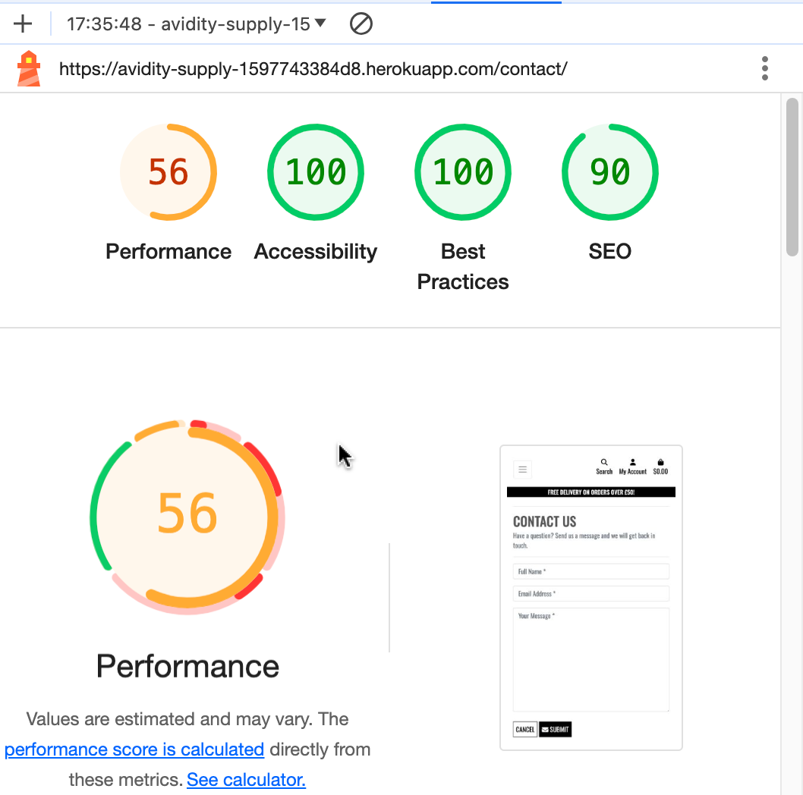 |
| Add Review | 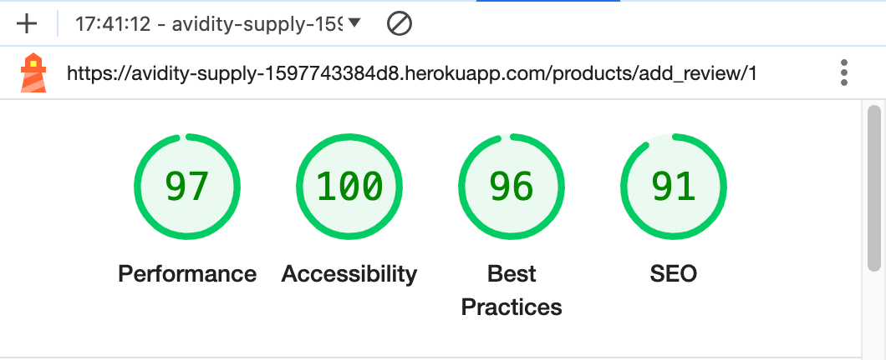 |
| Add Review (mobile) | 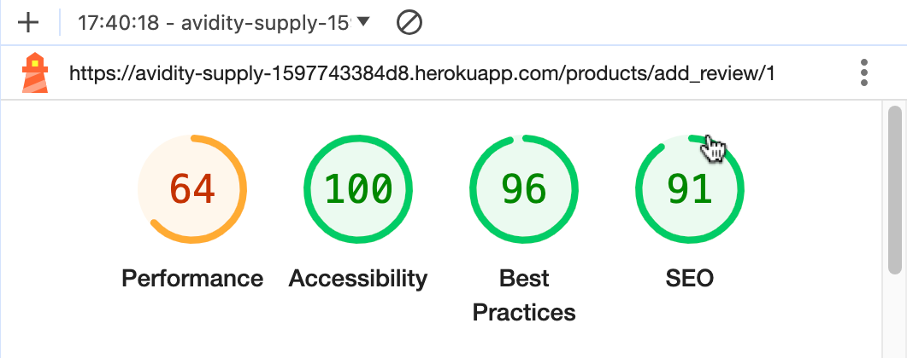 |

#### Devices used for testing:
- MacBook Pro
- Samsung Galaxy S23+
- Samsung Galaxy S23
- iPhone 14

#### Browsers Used for Testing
- Google Chrome
- Monzila FireFox
- Safari 
No issues found