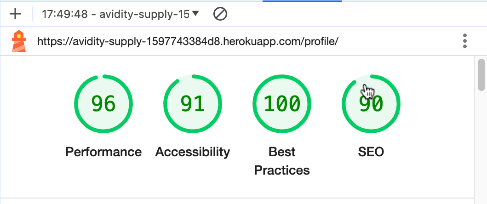
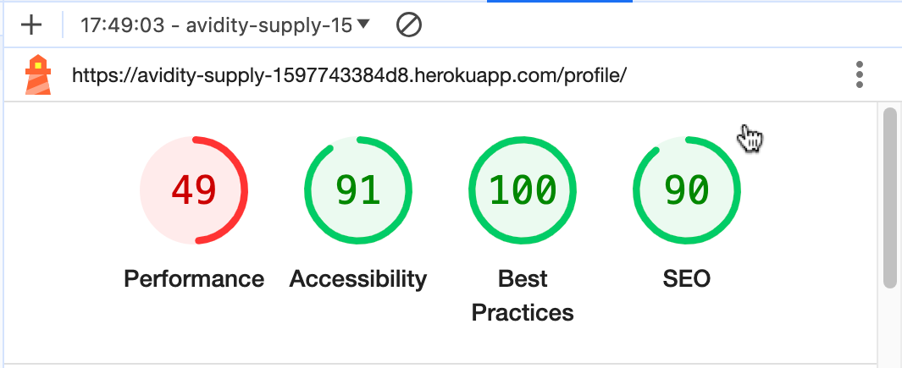

# Avidity Supply

## Testing

### Code Validation

#### HTML
The [W3C Markup Validator](https://validator.w3.org/) service was used to validate the site's pages to ensure there were no syntax errors.

Home

Bag

Checkout

Checkout Success

Products

Product Detail

Product Management

Add Product

Edit Product

Add Review

Contact

#### CSS
The [W3 CSS Validator](https://jigsaw.w3.org/css-validator/) was used to validate custom css styling.

base.css

checkout.css

profile.css

#### JS
[JS HINT](https://jshint.com/) was used to test JaveaScript.

stripe_element.js

countryfield.js

#### Python
[CI Pythong Linter](https://pep8ci.herokuapp.com/#) has been used to validate my python code and esnured it's pep8 compliant.

All python code created or automatically generated was validated and corrected and now displays no errors, so I have only provided the single screenshot.
- Note - some lines were too long and in an effort not to causes issues with my project '# NOQA' was used.

Python Validation

### Manual Testing

#### Testing User Stories

##### VIEWING & NAVIGATION 
| As a    | I want to be able to            | So that I can | Image |
|---------|---------------------------------|---------------|----------------------------------|
| Shopper | Easily navigate the site        | Find products to purchase                                                               |   |
| Shopper | View products by category       | Find specific items I am interested in without having to scroll through all products    |   |
| Shopper | View details of each product    | Learn more about each product                                                           |     |
| Shopper | View the items I have in my bag | Check whether I still wish to purchase the items and amend the quantity if required     |   |

#### REGISTRATION & USER ACCOUNTS
| As a    | I want to be able to  | So that I can | Image |
|---------|------------------------|--------| ---------- |
| Shopper | Register an account                         | Have an account with the site and view my profile   |    |
| Registered User | Receive an email to confirm my registration | Verify my account was created successfully    |  |
| Registered User | Log in and out                              | Keep my account information secure                       |    |
| Registered User | View a profile page                         | Set a default delivery address and view previous orders  |    |
| Registered User | Reset my password                           | Recover my account                                       |   |

#### SORTING & SEARCHING
| As a    | I want to be able to | So that I can | Image |
|---------|----------------------|---------------|-------|
| Shopper | Search for a product by name or description | Find a specific product I'd like to purchase |   |
| Shopper | Find products from a specific category      | Only see products from that category         |  |

#### PURCHASING & CHECKOUT
| As a    | I want to be able to | So that I can| Image |
|---------|----------------------|--------------|-------|
| Shopper | Easily select the quantity of a product when purchasing it  | Ensure I don't accidentally select the wrong product quantity |  |
| Shopper | View all items in my bag  | Make sure I haven't accidentally added the wrong product in my bag |  |
| Shopper | Adjust the quantity of individual items in my bag | Easily make changes to my purchase before checkout |  |
| Shopper | Easily enter my payment information | Check out quickly and with no hassle |  |
| Shopper | Save all address info | I don't have to enter them again on my next order |  |
| Shopper | View an order confirmation after checkout | Make sure my order was successfully placed and double check that all details are correct  |  |
| Shopper | Save all orders on my Profile | Easily access all orders anytime |  |
| Shopper | Receive an email confirmation after checking out | Keep the confirmation of what I've purchased for my records |  |

#### REVIEW
| As a    | I want to be able to | So that I can | Image |
|---------|----------------------|---------------|-------|
| Shopper | Read product reviews | Find out what other shoppers think about the product |  |
| Shopper | Add a product review | Share my experience using the product with other shoppers|  |
| Registered User | Delete a review if enetered incorrectly | Share my experience using the product with other shoppers| |
| Store Owner | Delete a review | Remove product review if deemed inaccuarte or entered incorrectly |  |

#### CONTACT
| As a    | I want to be able to  | So that I can| Image |
|---------|-----------------------|--------------|-------|
| Shopper/User | Contact the admin team | Make an enquiry |   |

#### ADMIN & STORE MANAGEMENT
| As a | I want to be able to | So that I can | Image |
|------|----------------------|---------------|-------|
| Store Owner/Admin | Add a product | Add new items to my store |  |
| Store Owner/Admin | Edit a product | Update product details |  |
| Store Owner/Admin | Delete a product | Remove items that are no longer for sale |  |
| Store Owner/Admin | Delete a product review | Remove product review if deemed inaccuarte or entered incorrectly |  |

#### Lighthouse

The Chrome Developer Tools lighthouse feature was employed to assess performance, adherence to best practices, accessibility, and Search Engine Optimisation (SEO). Both desktop and mobile tests were conducted.

- Several lighthouse tests performed, were below where I'd like them to be but due to time constraints, I was unable to improve the score but would in future implementations.

| Page | Results |
| --- | --- |
| Home |  |
| Home (mobile) |  |
| Products |  |
| Products (mobile) |  |
| Bag |  |
| Bag (mobile) |  |
| Checkout |  |
| Checkout (mobile) |  |
| Profile |  |
| Profile (mobile) |  |
| Contact |  |
| Contact (mobile) |  |
| Add Review |  |
| Add Review (mobile) |  |

#### Devices used for testing:
- MacBook Pro
- Samsung Galaxy S23+
- Samsung Galaxy S23
- iPhone 14

#### Browsers Used for Testing
- Google Chrome
- Monzila FireFox
- Safari 
No issues found