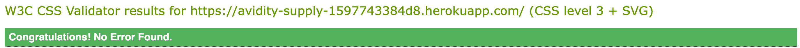

# Avidity Supply

## Testing

## Code Validation

### HTML
The [W3C Markup Validator](https://validator.w3.org/) service was used to validate the site's pages to ensure there were no syntax errors.

Home

Bag

Checkout

Checkout Success

Products

Product Detail

Product Management

Add Product

Edit Product

Add Review

Contact

### CSS
The [W3 CSS Validator](https://jigsaw.w3.org/css-validator/) was used to validate custom css styling.

base.css

checkout.css

profile.css

